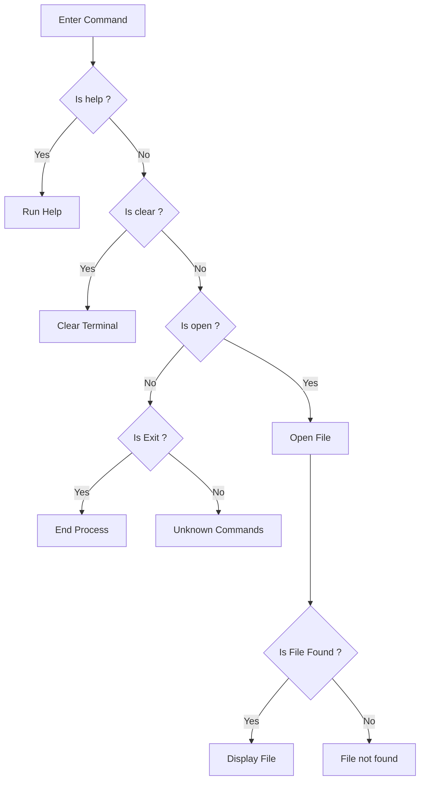

## Encrypt

Planning to do something!

### Build

`go build`

`cp encrypt /usr/local/bin`

encrypt

```mermaid
flowchart TD

A[Enter Command] --> B{Is help ?};
B -- Yes --> C[Run Help];
B -- No --> D{Is clear ?};
D -- Yes --> E[Clear Terminal];
D -- No --> F{Is open ?};
F -- Yes --> G[Open File];
F -- No --> L{Is Exit ?};
L -- Yes --> X[End Process];
L -- No --> H[Unknown Commands];
G ----> I{Is File Found ?};
I -- Yes --> J[ Display File ];
I -- No --> K[ File not found ];
```
