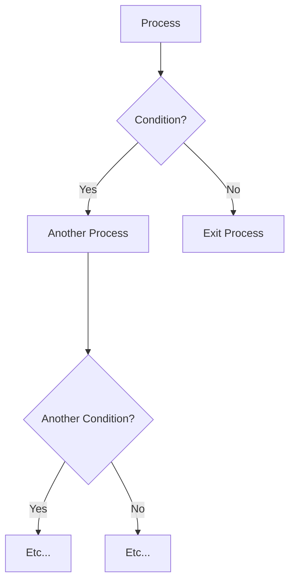

```mermaid
flowchart TD;

A[Process] --> B{Condition?};
B -- Yes --> C[Another Process];
B -- No --> D[Exit Process];
C ----> E{Another Condition?};
E -- Yes --> F[Etc...];
E -- No --> G[Etc...];
```
